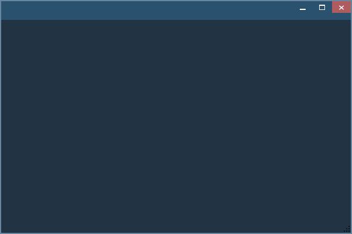

zORg's WPF Startup Project
--------------------------

This project was created to aid in starting a new project with completely customized window style. You'll have only what you've created.

It's now pretty outdated though. I'll add my new stydies when my current project will be closer to be finished so I'll put the best of it here.

* **zLib**

  Contains Classes that might be used throughout all the solution.

* **EffectLibrary**

  As the name says it's an effect Library. This thing is a CopyPaste from [Greg Schechter's tutorial on Effects][1]. Here is a [Build task][2] used in this project. I couldn't recreate this project (and keep BuildTask working), so I've just copied it.

* **ViewModel**

  Simply your ViewModel Dll. This way it will be separated from View in a right manner.

* **View**

  Here all UI related things go.

[1]:https://blogs.msdn.microsoft.com/greg_schechter/2008/05/12/writing-custom-gpu-based-effects-for-wpf/
[2]:http://wpf.codeplex.com/releases/view/14962